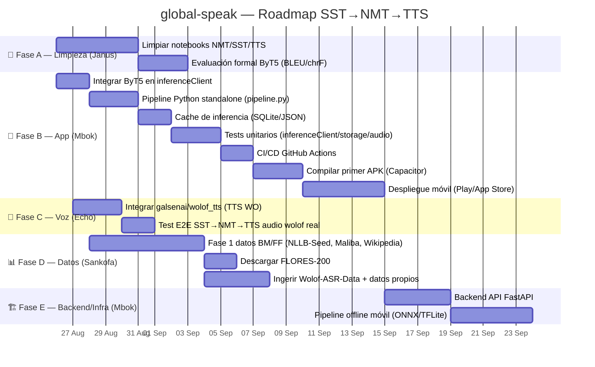

# 🗓️ GANTT — Global Speak Project

> Generado desde el kanban de Hermes (`hermes kanban` → board `global-speak`)
> **Actualizado:** 26 agosto 2026
> Fases por prioridad + dependencias lógicas (limpieza → evaluación → integración)



## Leyenda

| Fase | Prioridad | Agente | Depende de |
|---|---|---|---|
| A. Limpieza + evaluación | 🔴 Alta | Janus | — (desbloquea todo) |
| B. App + pipeline | 🔴 Alta | Mbok | — (paralela a A) |
| C. Voz wolof completa | 🔴 Alta | Echo | A (notebooks limpios) |
| D. Datos BM/FF | 🟡 Media | Sankofa | — (paralela) |
| E. Backend + offline | 🟢 Baja | Mbok | B (app estable) |

## Cómo regenerar

```bash
hermes kanban list --board global-speak   # estado vivo
# Actualizar este archivo cuando cambien fases/fechas
```

*Fuente de verdad diaria: kanban. Este Gantt es la vista temporal agregada.*
